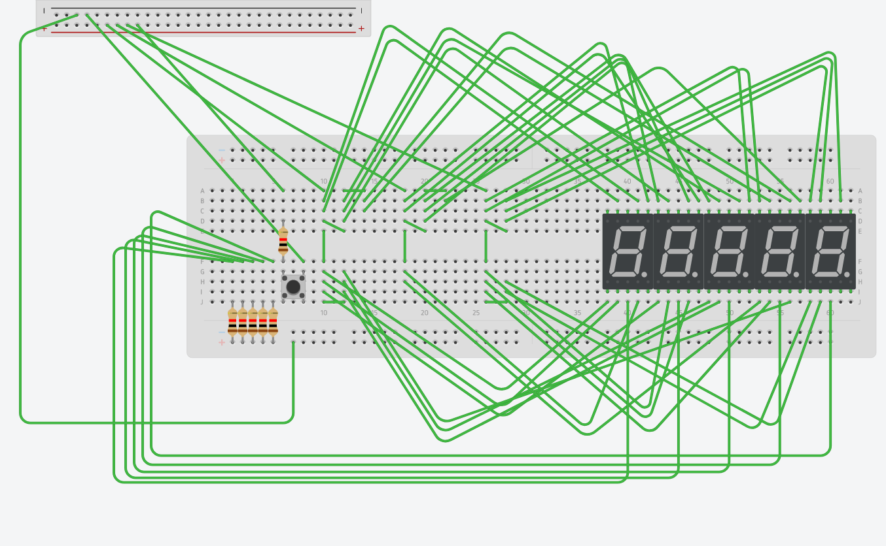
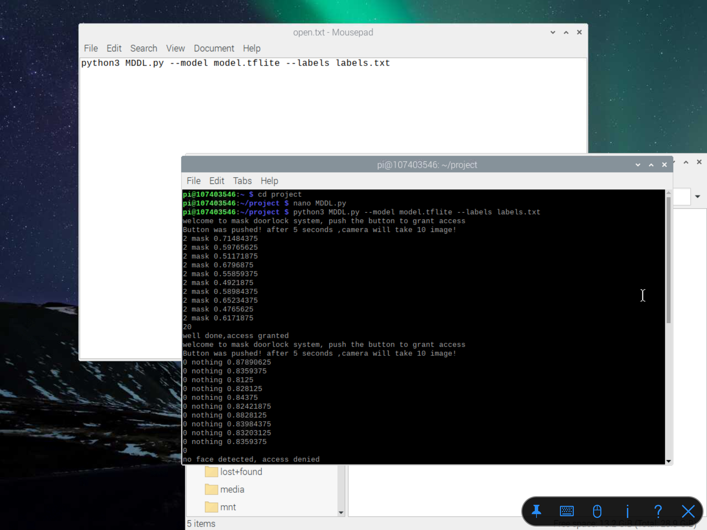

# MDDL
which stands for Mask Detection Door Lock.
2020 is a virus year. 
we need some protection. end up with this IOT device. it's a door lock with a camera, but has no lock on it. lock has been replaced with 5 seven segment lights which display open and close. camera will take 10 shots after button pushed, then using pre-trained model to determine you are wearing a mask or not. finally, it sends mails to phone's mailbox which responding door's status.
# Features
* Mask detection pre-trained model.
* Beautiful 5 seven segment displays with a LOTS of wires.
* SMTP is perfect setted which can know lock's status anywhere.
# Material
* Camera
* Breadboard
* Seven segment display*5
* Dupont Line*countless
* resister*6
* button*1
* Raspberry Pi 3B+ and a SD card
# Instruction
Train your own model on [Google Teachable Machine][src] .

  [src]: https://teachablemachine.withgoogle.com
1. Choose a new Image project


   Follow the steps a->b->c


   Export model into Tensorflow Lite Quantized


2. Turn on your raspberrypi 3B and open terminal
    WE have a LOTS of things to install!!!
  
    Install tensorflow lite (python version 3.6.1)
  ```
  $ pip3 install https://dl.google.com/coral/python/tflite_runtime-2.1.0.post1-cp36-cp36m-linux_armv7l.whl
  ```
3. Install opencv 4.4.0 (python version 3.6.1)
 
    Please do it carefully!! it will be failures everywhere!
  
    First check your raspberrypi is up to date!
    First check your raspberrypi is up to date!
    First check your raspberrypi is up to date!
  
    Dependencies you have to install:
  ```
  $ sudo apt-get update
  $ sudo apt-get upgrade
  $ sudo apt-get install cmake gfortran
  $ sudo apt-get install libjpeg-dev libtiff-dev libgif-dev
  $ sudo apt-get install libavcodec-dev libavformat-dev libswscale-dev
  $ sudo apt-get install libgtk2.0-dev libcanberra-gtk*
  $ sudo apt-get install libxvidcore-dev libx264-dev libgtk-3-dev
  $ sudo apt-get install libtbb2 libtbb-dev libdc1394-22-dev libv4l-dev
  $ sudo apt-get install libopenblas-dev libatlas-base-dev libblas-dev
  $ sudo apt-get install libjasper-dev liblapack-dev libhdf5-dev
  $ sudo apt-get install gcc-arm* protobuf-compiler
  $ pip3 install numpy
  ```
   Download OpenCV 4.4.0:
   
  Download.
  ```
  $ cd
  $ wget -O opencv.zip https://github.com/opencv/opencv/archive/4.4.0.zip
  $ wget -O opencv_contrib.zip https://github.com/opencv/opencv_contrib/archive/4.4.0.zip
  ```
  Unzip.
  ```
  $ unzip opencv.zip
  $ unzip opencv_contrib.zip
  ```
  Rename with simple names.
  ```
  $ mv opencv-4.4.0 opencv
  $ mv opencv_contrib-4.4.0 opencv_contrib
  ```
  OpenCV 4.4.0 Build&Make:
  You have to make a directory where all the build files can be located.
  ```
  $ cd ~/opencv/
  $ mkdir build
  $ cd build
  ```
  Here you tell CMake what, where and how to make OpenCV on your Raspberry.
  ```
  $ cmake -D CMAKE_BUILD_TYPE=RELEASE \
    -D CMAKE_INSTALL_PREFIX=/usr/local \
    -D OPENCV_EXTRA_MODULES_PATH=~/opencv_contrib/modules \
    -D PYTHON3_LIBRARY=/home/pi/berryconda3/lib/libpython3.6m.so \
    -D PYTHON3_PACKAGES_PATH=/home/pi/berryconda3/lib/python3.6/site-packages \
    -D BUILD_opencv_python3=TRUE \
    -D BUILD_opencv_python2=YES \
    -D ENABLE_NEON=ON \
    -D ENABLE_VFPV3=ON \
    -D BUILD_TIFF=ON \
    -D WITH_FFMPEG=ON \
    -D WITH_GSTREAMER=ON \
    -D WITH_TBB=ON \
    -D BUILD_TBB=ON \
    -D BUILD_TESTS=OFF \
    -D WITH_EIGEN=OFF \
    -D WITH_V4L=ON \
    -D WITH_LIBV4L=ON \
    -D WITH_VTK=OFF \
    -D CMAKE_SHARED_LINKER_FLAGS=-latomic \
    -D OPENCV_ENABLE_NONFREE=ON \
    -D INSTALL_C_EXAMPLES=OFF \
    -D INSTALL_PYTHON_EXAMPLES=OFF \
    -D BUILD_NEW_PYTHON_SUPPORT=ON \
    -D BUILD_opencv_python3=TRUE \
    -D OPENCV_GENERATE_PKGCONFIG=ON \
    -D BUILD_EXAMPLES=OFF ..
  ```
  REMEMBER TO CHECK IT CATCHES YOUR PYTHON 3'S LIBRARY!!!
  Change your swap size before make.
  ```
  $ sudo nano /etc/dphys-swapfile
  ```
  
  Restart swap service.
  ```
  $ sudo /etc/init.d/dphys-swapfile stop
  $ sudo /etc/init.d/dphys-swapfile start
  ```
  Make.
  ```
  $ make
  ```
  (Can use [make -j4] instead BUTTTTTT it can cause a lots of error such as no response, failure, overheat.)
  
  Now to complete, install all the generated packages to the database of your system with the next commands.
  ```
  $ sudo make install
  $ sudo ldconfig
  ```
  cleaning (frees 300 KB)
  ```
  $ make clean
  $ sudo apt-get update
  ```
  Resetting the swap space back to its original 100 Mbyte. 
  ```
  $ sudo nano /etc/dphys-swapfile
  ```
  Checking.
  REBOOT is require.
  Last thing to do to decide you are gonna do all these thing again or not!!
  ```
  $ python
  ```
  ```
  import cv2
  cv2.__version__
  ```
  If you get no warings, CONGRATULATIONS!
  4. build project.
  Make a directory to place our project
  ```
  $ cd
  $ mkdir project
  ```
  Place pretrained model's zip file and my Python file(MDDL.py) into this folder.
  
  (Can use google drive to upload or download files easily)
  
  After extract zip file, it will be three file in folder.(\*model.tflite\* , \*labels.txt\* and \*MDDL.py\*)
  
  5. build device in real life by our hands.
  Here is the circuit.
  
  Here is device's full picture.
  
  
  6.Run the program!
  
  MDDL.py
  ```
from __future__ import absolute_import
from __future__ import division
from __future__ import print_function

import argparse
import io
import time
import numpy as np
#import picamera
import cv2
#import tensorflow as tf
from PIL import Image
from tflite_runtime.interpreter import Interpreter
#import GPIO and time
import RPi.GPIO as GPIO # Import Raspberry Pi GPIO library
import time
#import SMTP
import smtplib

GPIO.setwarnings(False) # Ignore warning for now
GPIO.setmode(GPIO.BOARD) # Use physical pin numbering
GPIO.setup(10, GPIO.IN, pull_up_down=GPIO.PUD_DOWN) # Set pin 10 to be an input pin and set initial value to be pulled low (off)
GPIO.setup(11, GPIO.OUT)
GPIO.setup(13, GPIO.OUT)
GPIO.setup(15, GPIO.OUT)

def load_labels(path):
	with open(path, 'r') as f:
		return {i: line.strip() for i, line in enumerate(f.readlines())}


def set_input_tensor(interpreter, image):
	tensor_index = interpreter.get_input_details()[0]['index']
	input_tensor = interpreter.tensor(tensor_index)()[0]
	input_tensor[:, :] = image


def classify_image(interpreter, image, top_k=1):
	"""Returns a sorted array of classification results."""
	set_input_tensor(interpreter, image)
	interpreter.invoke()
	output_details = interpreter.get_output_details()[0]
	output = np.squeeze(interpreter.get_tensor(output_details['index']))

	# If the model is quantized (uint8 data), then dequantize the results
	if (output_details['dtype'] == np.uint8):
		scale, zero_point = output_details['quantization']
		output = scale * (output - zero_point)

	ordered = np.argpartition(-output, top_k)
	return [(i, output[i]) for i in ordered[:top_k]]


def main():
	parser = argparse.ArgumentParser(formatter_class=argparse.ArgumentDefaultsHelpFormatter)
	parser.add_argument(      '--model', help='File path of .tflite file.', required=True)
	parser.add_argument(      '--labels', help='File path of labels file.', required=True)
	args = parser.parse_args()
	labels = load_labels(args.labels)

	#interpreter = tf.lite.Interpreter(args.model)
	interpreter = Interpreter(args.model)

	interpreter.allocate_tensors()
	_, height, width, _ = interpreter.get_input_details()[0]['shape']
	op=0
	zUser = 'ncustudent00@gmail.com'
	zPass = 'au4a83123'
	zTo = 'supermice0000@gmail.com'
	zFrom = zUser
	zSubject = 'Mask Doorlock System'
	zHeader = 'To: ' + zTo + '\n' + 'From: ' + zFrom + '\n' + 'Subject: ' + zSubject

	try:
		while True: # Run forever
			if(op==0):
				print("welcome to mask doorlock system, push the button to grant access")
				op=1
			GPIO.output(11,1)
			GPIO.output(15,1)
			GPIO.output(13,0)
			if GPIO.input(10) == GPIO.HIGH:
				print("Button was pushed! after 5 seconds ,camera will take 10 image!")
				#with picamera.PiCamera(resolution=(640, 480), framerate=30) as camera:
				#camera.start_preview()
				cap = cv2.VideoCapture(0)
				cap.set(cv2.CAP_PROP_FRAME_WIDTH,1920)
				cap.set(cv2.CAP_PROP_FRAME_HEIGHT, 1080)
				time.sleep(5)
				key_detect=0
				times=1
				sum=0
				op=0
				while (key_detect==0):
					ret,image_src =cap.read()
					frame_width=image_src.shape[1]
					frame_height=image_src.shape[0]
					cut_d=int((frame_width-frame_height)/2)
					crop_img=image_src[0:frame_height,cut_d:(cut_d+frame_height)]
					image=cv2.resize(crop_img,(224,224),interpolation=cv2.INTER_AREA)
					start_time = time.time()
					if (times<11):
						results = classify_image(interpreter, image)
						elapsed_ms = (time.time() - start_time) * 1000
						label_id, prob = results[0]
						print(labels[label_id],prob)
						cv2.putText(crop_img,labels[label_id] + " " + str(round(prob,3)), (5,30), cv2.FONT_HERSHEY_SIMPLEX, 1, (0,0,255), 1, cv2.LINE_AA)
						sum=sum+label_id
						times=times+1
					if (times==11):
						key_detect = 1
					cv2.imshow('Detecting....',crop_img)
				cap.release()
				cv2.destroyAllWindows()
				if (sum<6):
					print(sum)
					print("no face detected, access denied")
					GPIO.output(15,1)
					GPIO.output(13,0)
					zBody = 'Response request: No\nLock Status: Close\nDetect Status: No Face Detected\nThis mail is auto-generated by system\nPlease do not reply!'
					oSmtp = smtplib.SMTP('smtp.gmail.com',587)
					oSmtp.starttls()
					oSmtp.ehlo()
					oSmtp.login(zUser, zPass)
					oSmtp.sendmail(zFrom, zTo, zHeader + '\n\n' + zBody)
					oSmtp.quit()
				if (sum>5 and sum<16):
					print(sum)
					print("not wearing mask, wait for manager response")
					GPIO.output(15,1)
					GPIO.output(13,0)
					zBody = 'Response request: Yes\nLock Status: Close\nDetect Status: NO  Masked Face\nThis mail is auto-generated by system\nPlease do not reply!'
					oSmtp = smtplib.SMTP('smtp.gmail.com',587)
					oSmtp.starttls()
					oSmtp.ehlo()
					oSmtp.login(zUser, zPass)
					oSmtp.sendmail(zFrom, zTo, zHeader + '\n\n' + zBody)
					oSmtp.quit()
					while True:
						answer = input('you have no mask on, please wait for manager answer:[y/n]')
						if (answer is 'y'):
							print("access granted, do not forget wearing mask next time!")
							GPIO.output(13,1)
							GPIO.output(15,0)
							zBody = 'Response request: No\nLock Status: Open for 5 secons\nDetect Status: NO  Masked Face\nThis mail is auto-generated by system\nPlease do not reply!'
							oSmtp = smtplib.SMTP('smtp.gmail.com',587)
							oSmtp.starttls()
							oSmtp.ehlo()
							oSmtp.login(zUser, zPass)
							oSmtp.sendmail(zFrom, zTo, zHeader + '\n\n' + zBody)
							oSmtp.quit()
							break
						elif(answer is 'n'):
							print("access denied, do not forget wearing mask next time!")
							GPIO.output(13,0)
							GPIO.output(15,1)
							zBody = 'Response request: No\nLock Status: Close\nDetect Status: NO  Masked Face\nThis mail is auto-generated by system\nPlease do not reply!'
							oSmtp = smtplib.SMTP('smtp.gmail.com',587)
							oSmtp.starttls()
							oSmtp.ehlo()
							oSmtp.login(zUser, zPass)
							oSmtp.sendmail(zFrom, zTo, zHeader + '\n\n' + zBody)
							oSmtp.quit()
							break
				if (sum>15):
					print(sum)
					print("well done,access granted")
					GPIO.output(13,1)
					GPIO.output(15,0)
					zBody = 'Response request: No\nLock Status: Open for 5 seconds\nDetect Status: A Masked Face\nThis mail is auto-generated by system\nPlease do not reply!'
					oSmtp = smtplib.SMTP('smtp.gmail.com',587)
					oSmtp.starttls()
					oSmtp.ehlo()
					oSmtp.login(zUser, zPass)
					oSmtp.sendmail(zFrom, zTo, zHeader + '\n\n' + zBody)
					oSmtp.quit()
					time.sleep(5)
					GPIO.output(13,0)
					GPIO.output(15,1)
	finally:
		GPIO.cleanup()

if __name__ == '__main__':
  main()

  ```
  change some SMTP parameter to personal account
  ```
  zUser = 'ncustudent00@gmail.com'
	zPass = 'au4a83123'
	zTo = 'supermice0000@gmail.com'
  ```
  zUser and zPass stands for sender's mailbox and passwords
  zTo stands for receiver's mailbox
  
  Last thing, RUN!
  ```
  $ cd project
  $ python MDDL.py --model model.tflite --labels labels.txt
  ```
  
  ## Demo video 
https://youtu.be/Wgd7RetdNmU

REFERENCE
https://stackoverflow.com/questions/42638342/cannot-install-opencv-3-1-0-with-python3-cmake-not-including-or-linking-python
https://www.rs-online.com/designspark/google-teachable-machine-raspberry-pi-4-cn
https://qengineering.eu/install-opencv-4.4-on-raspberry-pi-4.html
https://teachablemachine.withgoogle.com/
https://books.bod.idv.tw/2019/07/raspberry-pi-ssmtp-google-gmail-python.html
