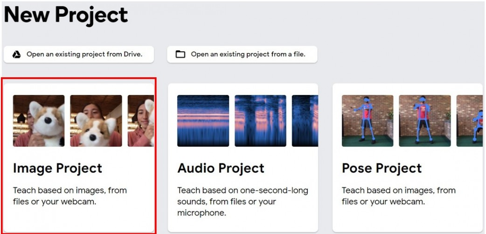
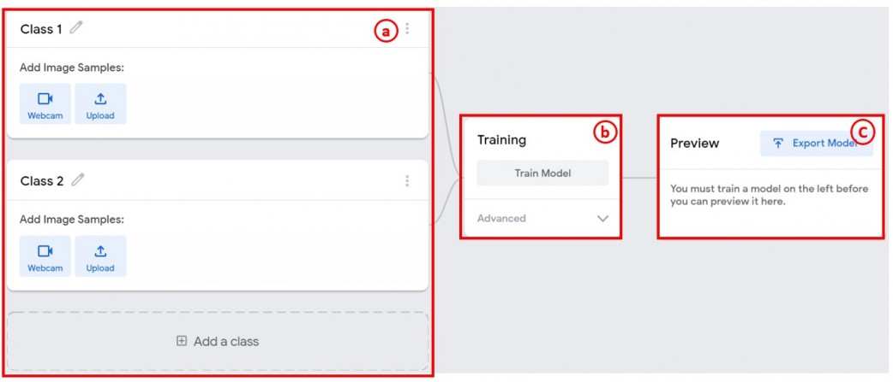
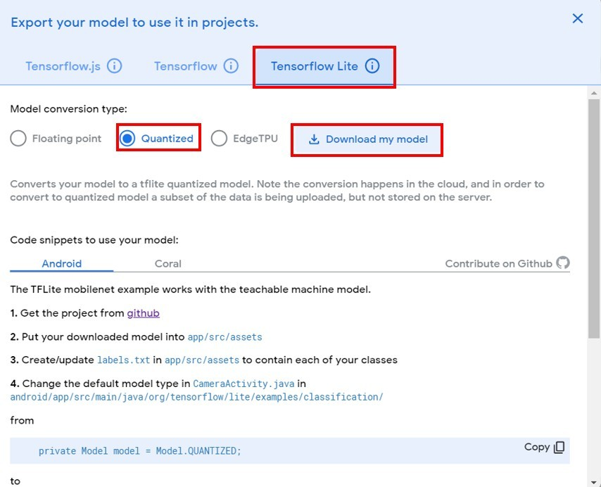
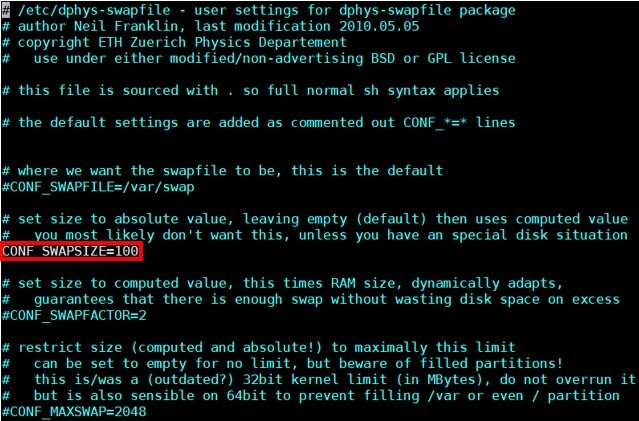

# MDDL
which stands for Mask Detection Door Lock.
2020 is a virus year. 
we need some protection. end up with this IOT device. it's a door lock with a camera, but has no lock on it. lock has been replaced with 5 seven segment lights which display open and close. camera will take 10 shots after button pushed, then using pre-trained model to determine you are wearing a mask or not. finally, it sends mails to phone's mailbox which responding door's status.
# Features
* Mask detection pre-trained model.
* Beautiful 5 seven segment displays with a LOTS of wires.
* SMTP is perfect setted which can know lock's status anywhere.
# Material
* Camera
* Breadboard
* Seven segment display*5
* Dupont Line*countless
* resister*6
* button*1
* Raspberry Pi 3B+ and a SD card
# Before Getting Start
Train your own model on [Google Teachable Machine][src] .

  [src]: https://teachablemachine.withgoogle.com
1. Choose a new Image project


  Follow the steps a->b->c


  Export model into Tensorflow Lite Quantized


2. Turn on your raspberrypi 3B and open terminal
  WE have a LOTS of things to install!!!
  
  Install tensorflow lite (python version 3.6.1)
  ```
  $ pip3 install https://dl.google.com/coral/python/tflite_runtime-2.1.0.post1-cp36-cp36m-linux_armv7l.whl
  ```
 3. Install opencv 4.4.0 (python version 3.6.1)
 
  Please do it carefully!! it will be failures everywhere!
  
  First check your raspberrypi is up to date!
  First check your raspberrypi is up to date!
  First check your raspberrypi is up to date!
  
  Dependencies you have to install:
  ```
  $ sudo apt-get update
  $ sudo apt-get upgrade
  $ sudo apt-get install cmake gfortran
  $ sudo apt-get install libjpeg-dev libtiff-dev libgif-dev
  $ sudo apt-get install libavcodec-dev libavformat-dev libswscale-dev
  $ sudo apt-get install libgtk2.0-dev libcanberra-gtk*
  $ sudo apt-get install libxvidcore-dev libx264-dev libgtk-3-dev
  $ sudo apt-get install libtbb2 libtbb-dev libdc1394-22-dev libv4l-dev
  $ sudo apt-get install libopenblas-dev libatlas-base-dev libblas-dev
  $ sudo apt-get install libjasper-dev liblapack-dev libhdf5-dev
  $ sudo apt-get install gcc-arm* protobuf-compiler
  $ pip3 install numpy
  ```
  Download OpenCV 4.4.0:
  Download.
  ```
  $ cd
  $ wget -O opencv.zip https://github.com/opencv/opencv/archive/4.4.0.zip
  $ wget -O opencv_contrib.zip https://github.com/opencv/opencv_contrib/archive/4.4.0.zip
  ```
  Unzip.
  ```
  $ unzip opencv.zip
  $ unzip opencv_contrib.zip
  ```
  Rename with simple names.
  ```
  $ mv opencv-4.4.0 opencv
  $ mv opencv_contrib-4.4.0 opencv_contrib
  ```
  OpenCV 4.4.0 Build&Make:
  You have to make a directory where all the build files can be located.
  ```
  $ cd ~/opencv/
  $ mkdir build
  $ cd build
  ```
  Here you tell CMake what, where and how to make OpenCV on your Raspberry.
  ```
  $ cmake -D CMAKE_BUILD_TYPE=RELEASE \
    -D CMAKE_INSTALL_PREFIX=/usr/local \
    -D OPENCV_EXTRA_MODULES_PATH=~/opencv_contrib/modules \
    -D PYTHON3_LIBRARY=/home/pi/berryconda3/lib/libpython3.6m.so \
    -D PYTHON3_PACKAGES_PATH=/home/pi/berryconda3/lib/python3.6/site-packages \
    -D BUILD_opencv_python3=TRUE \
    -D BUILD_opencv_python2=YES \
    -D ENABLE_NEON=ON \
    -D ENABLE_VFPV3=ON \
    -D BUILD_TIFF=ON \
    -D WITH_FFMPEG=ON \
    -D WITH_GSTREAMER=ON \
    -D WITH_TBB=ON \
    -D BUILD_TBB=ON \
    -D BUILD_TESTS=OFF \
    -D WITH_EIGEN=OFF \
    -D WITH_V4L=ON \
    -D WITH_LIBV4L=ON \
    -D WITH_VTK=OFF \
    -D CMAKE_SHARED_LINKER_FLAGS=-latomic \
    -D OPENCV_ENABLE_NONFREE=ON \
    -D INSTALL_C_EXAMPLES=OFF \
    -D INSTALL_PYTHON_EXAMPLES=OFF \
    -D BUILD_NEW_PYTHON_SUPPORT=ON \
    -D BUILD_opencv_python3=TRUE \
    -D OPENCV_GENERATE_PKGCONFIG=ON \
    -D BUILD_EXAMPLES=OFF ..
  ```
  REMEMBER TO CHECK IT CATCHES YOUR PYTHON 3'S LIBRARY!!!
  Change your swap size before make.
  ```
  $ sudo nano /etc/dphys-swapfile
  ```
  
  Restart swap service.
  ```
  $ sudo /etc/init.d/dphys-swapfile stop
  $ sudo /etc/init.d/dphys-swapfile start
  ```
  Make.
  ```
  $ make
  ```
  (Can use [make -j4] instead BUTTTTTT it can cause a lots of error such as no response, failure, overheat.)
  
  Now to complete, install all the generated packages to the database of your system with the next commands.
  ```
  $ sudo make install
  $ sudo ldconfig
  ```
  cleaning (frees 300 KB)
  ```
  $ make clean
  $ sudo apt-get update
  ```
  Resetting the swap space back to its original 100 Mbyte. 
  ```
  $ sudo nano /etc/dphys-swapfile
  ```
  Checking.
  REBOOT is require.
  Last thing to do to decide you are gonna do all these thing again or not!!
  ```
  $ python
  ```
  ```
  import cv2
  cv2.__version__
  ```
  If you get no warings, CONGRATULATIONS!
  4. build project.
  Make a directory to place our project
  ```
  $ cd
  $ mkdir project
  $ cd project
  ```
  Place pretrained model's zip file and my Python file(MDDL.py) into this folder.
  (Can use google drive to upload or download files easily)
  After extract zip file, it will be three file in folder.(\*model.tflite\* , \*labels.txt\* and \*MDDL.py\*)
  5. build device in real life by our hands.
  
  5.
